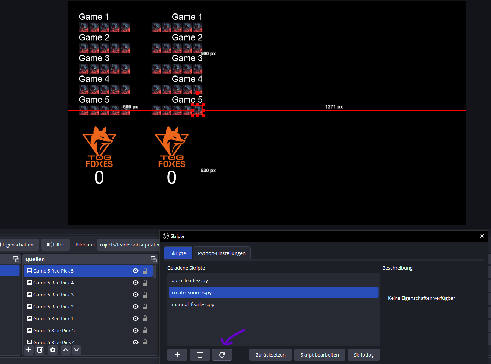
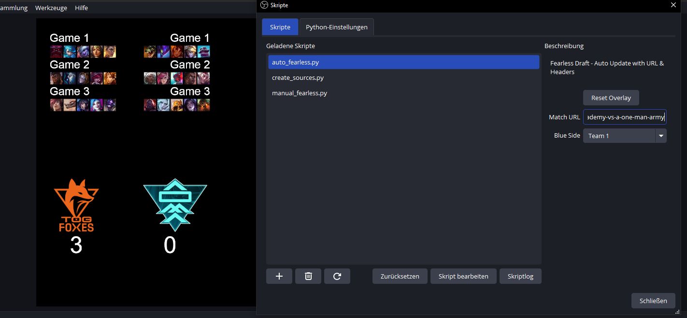
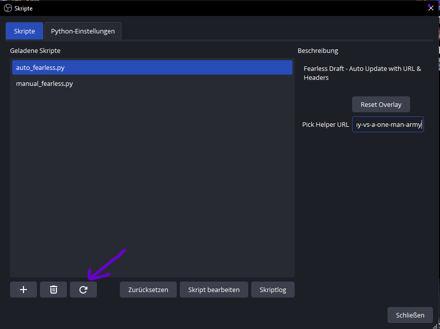
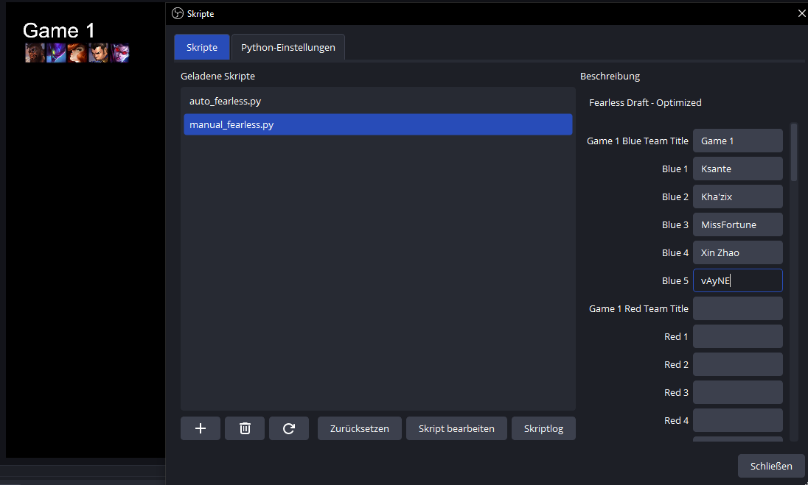

# Fearless OBS Updater

This Project is able to create sources in OBS and update them to display the already picked champions of the series.

Currently, it is only possible to track matches of the 1st and 2nd division of the "Techniker Prime League". 
This tool is meant for **Co-Streamers** of these divisions.

This is due to the fact that only 1st and 2nd division are live updated on the website!

## Install Python

To use the script, you need to download Python 3.9.10 or later from the official Python website.

[Download Python 3.9.10](https://www.python.org/downloads/release/python-3910/)

Make sure to click on "Add to path" or something like that when the installer appears!

## Install Requirements

### Windows:

Open CMD and run:

`pip install -r /path/to/requirements.txt`

e.g. `C:\Users\MartinPC\Downloads\fearlessobsupdater-main\requirements.txt`

## Setup Script in OBS

1. Go to **Tools** -> **Scripts** in OBS.
2. Under **Python-Settings**, insert the location of your local Python directory `C:/Users/{name}/AppData/Local/Programs/Python/Python39`
3. Add the scripts `manual_fearless.py`, `auto_fearless.py` and `create_sources.py` by clicking the **+** icon.
4. Close and reopen OBS to fully initialize the changes.
5. Return to the scripts tab and start using them.

## Setup Sources in OBS

Update: You can now automatically create the sources needed by running the `create_sources.py` script.
This will create all available sources. You can either delete or hide the ones you don't need. The scripts **won't** cause
any errors if a source is not present. It will also not create duplicates!

## How to Use the Scripts

### Create Sources

When you load the script for the first time it should automatically create all needed sources. If you deleted any sources and wish
them to come back you can rerun the script at any time by clicking the refresh button pointed at in the screenshot.

### Auto Fearless

The auto fearless script works automatically. When you open the script, you'll see an input field where you can insert a match URL.

For example:

`https://www.primeleague.gg/de/matches/591905-teamorangegaming-academy-vs-a-one-man-army`

After inserting the URL, the overlay will automatically update itself with data from the website.

If you want to update the same match again, press the **reload** button at the bottom of the script window.

By pressing the **Reset Overlay** button, you can clear all sources at once. You can now enter a new URL. If you want to reuse the same URL, you must press **Reset** (**"Zurücksetzen"**) at the bottom of the script window, which clears all input fields.

In the dropdown menu you can select which team is placed on blue side. Team 1 will always be the left team from the Prime League website.
If you switch the team on blue sides all Picks, Scores and the Team Logo will switch sides.

### Manual Fearless

The manual fearless script is an alternative if the Prime League match on the website is not updated properly.

You can manually enter data in real-time. The input is **not case-sensitive**, champion names can have **whitespaces**, and you can use special characters such as `'` (e.g., "Kha'Zix").

Example:

Unlike the auto script, you don't need a special reset button. The script updates dynamically whenever you update the input. To reset everything, just press **Reset** (**"Zurücksetzen"**) at the bottom of the window.

### General Information

- The script will only display an icon if the name is spelled correctly. If there's a typo, no champion icon will be displayed.
- Both scripts share the same sources, meaning changes in one script will overwrite the other.
- If you use the auto script and then open the manual script to change the **first pick on the blue side**, it will overwrite only that specific pick.
- Using the auto script will update the entire overlay and erase any manually entered data that is not part of the match URL.

## FAQ - Coming Soon

A FAQ section will be added once common issues arise.

## How to Contribute

If you have suggestions to improve the code or want to contribute, feel free to create a pull request.

## Contact Me

If you need help or want to be part of the project, contact me via GitHub or email: **lukas.zimmermann147@outlook.com**

## License

[MIT License](https://choosealicense.com/licenses/mit/)
